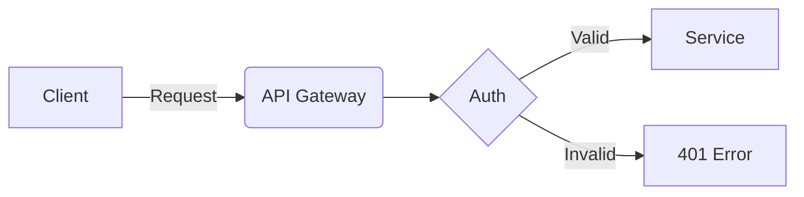
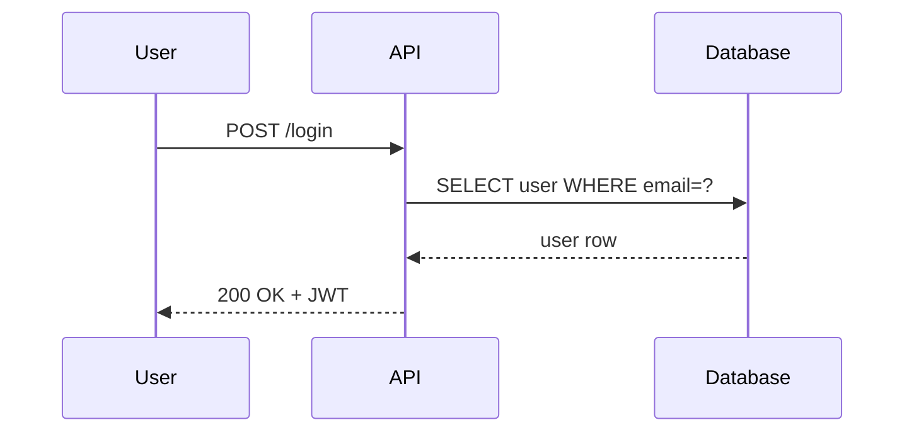
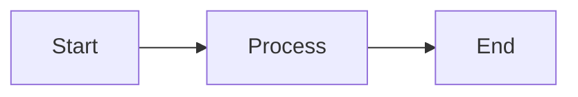

Use a `mermaid` code fence to embed flowcharts, sequence diagrams,
entity-relationship diagrams, and any other
[Mermaid](https://mermaid.js.org)-supported diagram type. Diagrams are rendered
client-side on first view.

## Flowchart



## Sequence diagram



````mdx

````

<Note>
  Existing `<Mermaid chart={\`...\`} />` usage remains supported for migrated
  content, but the fenced syntax is recommended for new pages.
</Note>

## Props

| Prop | Type | Description |
|---|---|---|
| `chart` | `string` | Backward-compatible component definition string |
